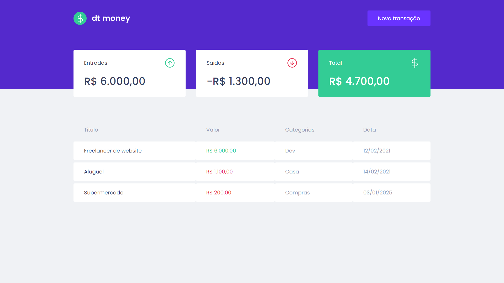
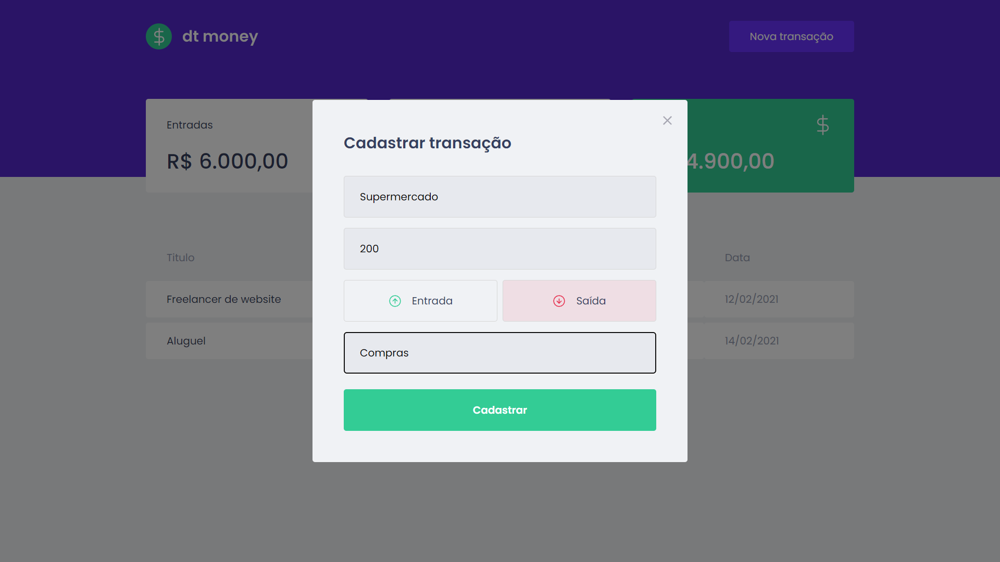

  

---

### Descrição

Este projeto eh algo simples que fiz apenas para iniciar um estudo mais aprofundado no front-end. Para criar esse projeto optei por utilizar o framework React.

A aplicação é muito parecido com o classico to-do list, porém em vez de tarefas cotidianas, o usuário registra entradas e saídas financeiras que ele teve, tendo um summary que mostra quanto entrou no total, quanto saiu e a diferença o total geral de gastos.

### Tecnologias utilizadas no projeto

- NodeJs
- React
- Mirage.js
- Styled Components
- Typescript
- Entre outros

---

## Tela Inicial

## Modal

